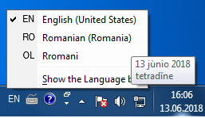
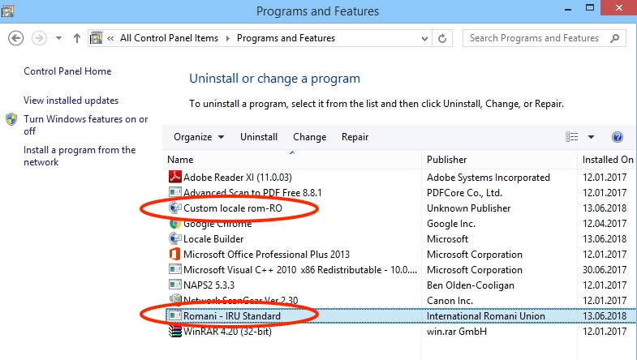

<p>
  
</p>
*Read this in other languages: [English](README.md), [Rromani](README.rom.md), [Română](README.ro.md).*

This project provides custom International Standard Romani keyboard layouts for Windows and MacOS systems, allowing easy access to the following special characters: 

| morpho-graphs | meta-notations | fricative / affricate  | unrounded vowels |
|----|----|----|----|
| ç, θ | ʒ, ǎ, ě, ǐ, ǒ, ǔ | ś, ć, ź | ä, ë, ï, ö, ü |

The International Standard Romani aphabet was devised by Romani linguist Marcel Courthiade and adopted by the International Romani Union at the Fourth Romani World Congress in Warsaw, Poland in April 1990.

## Getting Started

These instructions will help you install the keyboard layout on your computer. You should not need to close any programs or restart your computer in order for the new keyboard layout to be recognized.

- [Windows installation instructions](#windows-installation)
- [MacOSX installation instructions](#macosx-installation)


### Windows Installation

1. Download the Windows installer [**here**.](Romani_IRU_Windows.zip) Open the .ZIP file and double-click on the installer named **"Install_Rromani_Keyboard_IRU.exe"**.

<p>
  
</p>

2. The new keyboard layout should now appear in the list of languages in the language bar (in the taskbar) as "OL Rromani" (in Windows 7) or "ROM Rromani" (in Windows 8 or newer). If you don't see the Language bar, right-click the taskbar, point to **Toolbars,** and then click **Language bar.**

*NOTE: It is possible that the Romani keyboard will not appear in the list of languages in the Windows Control Panel 
"Keyboards and Languages" tab. This is a known issue and does not impair the functionality of the keyboard layout.*

## Windows Un-installation

To remove the Romani keyboard or custom locale, open the **Control Panel,** click on **Programs and features**, then select **"Romani - IRU Standard"** (for the keyboard layout) or **"Custome Locale rom-RO"** (for the locale).

<p>
  
</p>

### MacOSX Installation

A step by step series of examples that tell you how to get a development env running

Say what the step will be

```
Give the example
```

And repeat

```
until finished
```

End with an example of getting some data out of the system or using it for a little demo

## Built With

* [Microsoft Keyboard Layout Creator](https://www.microsoft.com/en-us/download/details.aspx?id=22339) - Windows Keyboard Layout
* [Microsoft Locale Builder](https://www.microsoft.com/en-us/download/details.aspx?id=41158) - Windows Custom Locale
* [Ukelele](http://scripts.sil.org/cms/scripts/page.php?site_id=nrsi&id=ukelele) - Mac OSX Keyboard Layout

## Contributing

Please read [CONTRIBUTING.md](https://gist.github.com/PurpleBooth/b24679402957c63ec426) for details on our code of conduct, and the process for submitting pull requests to us.

## Authors

* **Shaun Williams** - *Concept, creation* - [Beyond Karpaty](https://www.mutiny.net)

* **Ionel Cordovan** - *Design, consultation, testing*

* **George Sarău** - *Consultation, testing* [Minority Division, Romanian Ministry of Education](https://www.edu.ro/echipa%20minoritati)

See also the list of [contributors](https://github.com/your/project/contributors) who participated in this project.

## License

This project is licensed under the GNU General Public License v3.0 - see the [LICENSE.md](LICENSE.md) file for details.
