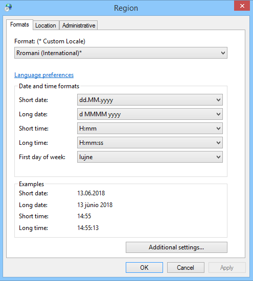
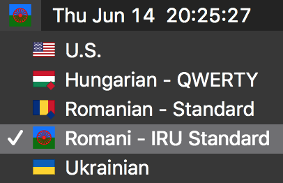

<!---

  

--->
*Citiți această pagină în alte limbi: [English](README.md), [Rromani](README.rom.md)*

Acest proiect oferă un aranjament de tastatură pentru limba rromani (standardul internațional IRU) pentru sistemele Windows și MacOS, care permite accesul ușor la următoarele caractere speciale:

| morfo-grafi | meta-notații | fricative / affricate  | vocalele nerotunjite |
|----|----|----|----|
| ç, θ | ʒ, ǎ, ě, ǐ, ǒ, ǔ | ś, ć, ź | ä, ë, ï, ö, ü |

Standardul internațional al limbii rromani a fost creat de lingvistul rrom Marcel Courthiade și adoptat de Uniunea Internațională a Romilor la al patrulea Congres Mondial al Romilor în Varșovia, Polonia, în aprilie 1990.

# Noțiuni de bază

Aceste instrucțiuni vă vor ajuta să instalați aranjamentul de tastatură pe calculator. Nu trebuie să închideți niciun program sau să reporniți calculatorul pentru a fi recunoscut aranjamentul nou.

- [Manual de instalare pentru Windows](#instalare-pentru-windows)
- [Manual de instalare pentru MacOS](#instalare-pentru-macos)
- [Ghid de referință pentru tastatura](#ghid-de-referințe)

# Instalare pentru Windows

1. Descărcați programul de instalare pentru Windows [**aici**](Romani_IRU_Windows.zip). Deschideți fișierul .ZIP și faceți dublu click pe programul de instalare **"Install_Rromani_Keyboard_IRU.exe"**.

  

2. Noul aranjament de tastatură ar trebui să apară acum în lista de limbi din bara lingvistică (în bara de activități) ca "OL Rromani" (Windows 7) sau "ROM Rromani" (Windows 8 sau mai nou). Dacă nu vedeți bara lingvistică, faceți click dreapta pe bara de jos, apoi alegeți **Toolbars,** iar acolo bifați **Bara lingvistică**.

*NOTĂ: Este posibil că limba rromani să nu apară în lista de limbi din fila "Tastaturi și limbi" din Panoul de control din Windows. Aceasta este o problemă cunoscută și nu afectează funcționalitatea aspectului tastaturii.*

## Rromani Locale pentru Windows
Windows utilizează setările numite "Locale" pentru a determina modul în care datele și numerele sunt afișate pe calculator. Pentru a instala o localizare a limbii rromani pentru Windows:

1. Descărcați pachetul de instalare [**aici**](Romani_IRU_Windows.zip).
2. Deschideți fișierul .ZIP și faceți dublu click pe programul de instalare **"Install_Locale_Rromani_IRU.msi".**
3. După terminarea instalării, faceți click pe deschiderea panoului de control și faceți click pe pictograma **Ceas, limbă și regiune,** apoi faceți click pe pictograma **Regiune și limbă.** În fila **Formate,** selectați **Rromani (International)** din meniul derulant pentru "Format".

  

## Dezinstalare pentru Windows
Pentru a elimina aranjamentul de tastatură rromani sau Locale pentru Windows, deschideți **Panoul de control,** faceți click pe **Programe și Caracteristici,** apoi selectați **"Romani - IRU Standard"** (pentru tastatura) sau **"Custome Locale rom-RO"** (pentru Locale).

  

# Instalare pentru MacOS
1. Descărcați imaginea discului de instalare MacOS [**aici**](Romani_IRU_Mac.dmg) și faceți dublu click pe fișierul .dmg pentru al deschide.

  

2. Trageți "Romani - IRU Standard.bundle" în dosarul din stânga. "Rromani - Standard IRU" ar trebui să apară acum în lista surselor de intrare din partea dreaptă (sus) a ecranului. Dacă nu apare sau dacă nu vedeți lista surselor de intrare, urmați aceste instrucțiuni:
   1. Alegeți meniul **Apple** > mergeți la **Preferințe sistem,** apoi faceți click pe panoul de preferințe **Tastatură.**
   2. Faceți click pe fila **Tastatură** și apoi selectați "Afișați telespectatorii și vizualizatorii emoji din bara de meniu".
   3. Faceți click pe fila **Surse de intrare**. Dacă tastatura rromani nu apare în lista din stânga, faceți click pe butonul **+** din partea stângă jos și selectați "Romany (Latin)" din lista limbilor din stânga, apoi faceți click pe **"Adăugați".**

# Ghid de referințe

- Descărcați PDF-ul de referințe pentru tastatura Windows [**aici**.](romani-keyboard-win.pdf) 
- Descărcați PDF-ul de referințe pentru tastatura MacOS [**here**.](romani-keyboard-mac.pdf) 

### Tastarea caracterelor speciale
(tastatură românească)

| Caracter | Windows | Mac  |
|----|----|----|
| ʒ | ``  ă  `` tasta | ``  ă  `` tasta |
| θ | ``  î  `` tasta | ``  î  `` tasta |
| ç | ``  â `` tasta | ``  â  `` tasta |
| ǎ | AltGr + a | Option + a |
| ě | AltGr + e | Option + e |
| ǐ | AltGr + i | Option + i |
| ǒ | AltGr + o | Option + o |
| ǔ | AltGr + u | Option + u |
| ś | ``  ș  `` tasta | ``  ș  `` tasta |
| ć | ``  ț  `` tasta | ``  ț  `` tasta | 
| ź | AltGr + z | Option + z |
| ä | AltGr + 2, apoi a | Option + 2, apoi a |
| ë | AltGr + 2, apoi e | Option + 2, apoi e |
| ï | AltGr + 2, apoi i | Option + 2, apoi i |
| ö | AltGr + 2, apoi o | Option + 2, apoi o |
| ü | AltGr + 2, apoi u | Option + 2, apoi u |

**************
## Construit cu

* [Microsoft Keyboard Layout Creator](https://www.microsoft.com/en-us/download/details.aspx?id=22339) - Windows Keyboard Layout
* [Microsoft Locale Builder](https://www.microsoft.com/en-us/download/details.aspx?id=41158) - Windows Custom Locale
* [Ukelele](http://scripts.sil.org/cms/scripts/page.php?site_id=nrsi&id=ukelele) - Mac OSX Keyboard Layout

## Autori

* **Shaun Williams** - *Concept, creație* - Blog: [Beyond Karpaty](https://www.mutiny.net)

* **Ionel Cordovan** - *Proiectare, consultare, testare*

* **George Sarău** - *Consultare, testare* - Website: [Minority Division, Romanian Ministry of Education](https://www.edu.ro/echipa%20minoritati)

## Licență
Acest proiect este licențiat sub licența GNU General Public v3.0 - pentru detalii, consultați fișierul [LICENSE.md](LICENSE.md).
